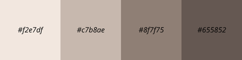

# emberTheme

## Funds and Surfaces

| Token  | Color     | Functions           |
| ------ | --------- | ------------------- |
| bg-0   | `#120e0c` | Absolute Fund       |
| bg-1   | `#181311` | Principal Editor    |
| bg-2   | `#211a17` | Sidebar / Panels    |
| bg-3   | `#2a221e` | Hover / Selection   |
| bg-4   | `#342b26` | Elevate Elements    |
| border | `#3f3530` | Borders             |

---

## Texts

| Token          | Color     | Usage                |
| -------------- | --------- | -------------------- |
| text-primary   | `#f2e7df` | Principal Text       |
| text-secondary | `#c7b8ae` | Secondary Text       |
| text-muted     | `#8f7f75` | Comments / Weak UI   |
| text-disabled  | `#655852` | Desactivated States  |

---

## Primary Accent — Dry Wine

| Token          | Color     | Usage               |
| -------------- | --------- | ------------------- |
| accent-primary | `#a64b5f` | Main Accent         |
| accent-hover   | `#bb5d72` | Hover State         |
| accent-active  | `#8d3e50` | Active / Pressed    |
| accent-soft    | `#4b2a31` | Soft Backgrounds    |

---

## Warm Secondary Accents

| Token       | Color     | Usage                  |
| ----------- | --------- | ---------------------- |
| ember       | `#d27a4a` | Highlights             |
| amber-soft  | `#b86b43` | Warm Interactive State |
| gold-muted  | `#c29a5f` | Numbers / Constants    |

